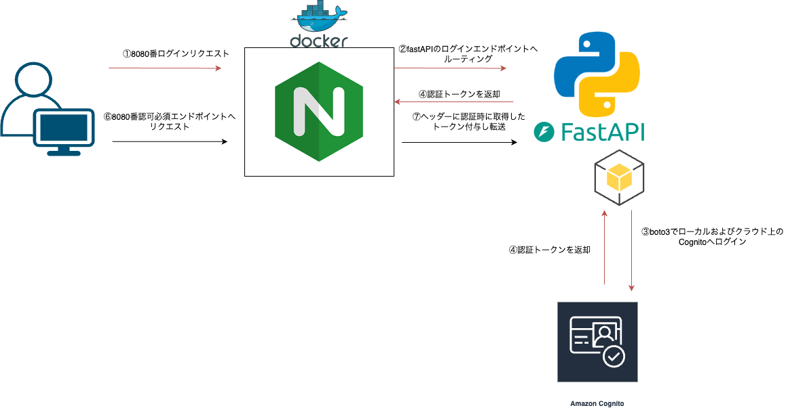

# alb-cognito-nginx

When performing authorizer authentication with ALB and Cognito, there are many AWS-specific features such as ALB forwarding settings.

This project aims to reduce the differences between local and cloud environments and facilitate efficient development.

Here, ALB is simulated by wrapping it with Nginx, mocking the forwarding settings. This allows development without modifying code for the backend or cloud environments.

ALBとCognitoでのオーソライザー認証を行う際、ALBの転送設定などAWS上固有の機能が多い。

ここでは、そういったローカルとクラウドの環境差分を減らし効率的な開発を目的としている。

ALBを擬似的にNginxでラップして、転送設定をモックしていており、バックエンドとクラウドでのコード変更をせずに開発できる。
## Base Architecture

This time, to replicate the forwarding headers after Cognito authentication on AWS, we use an Nginx reverse proxy. By adding the following headers to the authorized endpoints, the backend can receive user claims.

This library operates entirely with local Docker startup, eliminating environmental differences during backend API development.

The process is carried out as follows:

- Execute the login API to receive various tokens from Cognito (cloud or local) in response to Nginx.
- Use Lua on the Nginx side to store the received tokens as global variables (valid for 60 minutes).
- Add proxy_set_header in the Nginx configuration and forward requests to each endpoint.
- Retrieve and verify the headers on the backend.

Target forwarding headers:

- x-amzn-oidc-accessToken
- x-amzn-oidc-data

今回はAWS上のCognito認証後の転送ヘッダーの再現としてNginxのリバースプロキシを利用し、認可対象のエンドポイントに対して下記のヘッダーを付与することでバックエンドでのユーザークレームを受け取る。

本ライブラリではローカルでのdocker起動のみで完結し、バックエンドAPI開発時の環境差分を排除している。

具体的には以下の流れで行う。
- ログインAPIを実行することでCognito(クラウド or ローカル)からnginxに各種トークンをレスポンス
- nginx側でluaを用いて、受け取りグローバルな変数として各種必要なトークンを保持(期限60min)
- nginx設定でproxy_set_headerを付与し、各エンドポイントへ転送する。
- バックエンド側でヘッダーの取得し確認

対象転送ヘッダー
- x-amzn-oidc-accessToken
- x-amzn-oidc-data



## Get Start
By executing the following command, you can start both the Nginx and backend servers.

By modifying the location path and proxy_pass in the Nginx configuration file, you can connect to your locally running application.


下記コマンドを実行することでnginxおよびバックエンドサーバーの起動を行う。

nginx設定ファイル内のlocationで記載されるpathおよびproxy_pathを変更することで自身のローカル起動のアプリケーションと接続できる。

```
$ pwd
> ~~/alb-cognito-python

$ git clone <this repository>

$ sh set-up.sh
```


